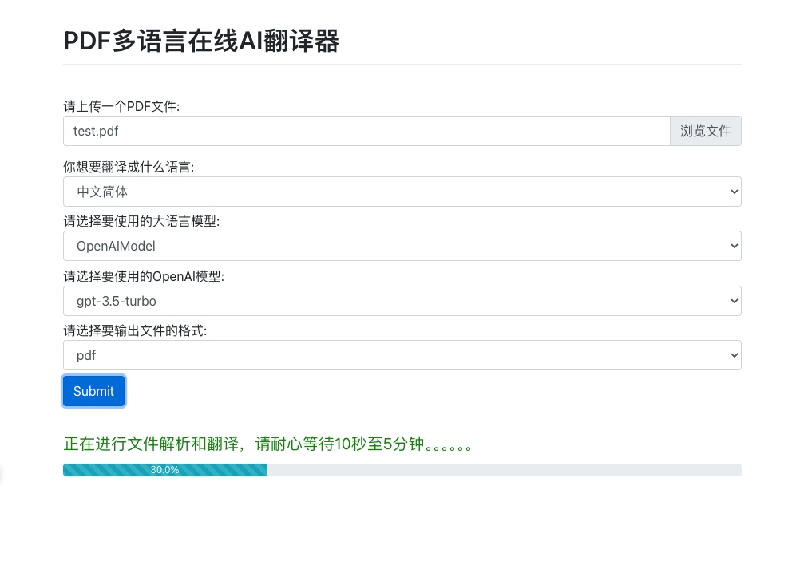

# jk_translator
## 介绍
该项目支持通过大语言模型将pdf文件翻译为指定语言。
## 使用指引
### 步骤一: 环境配置
执行下面命令配置环境变量和安装依赖
```bash
# 将您的 api_key 设置为环境变量
export GLM_MODEL_URL="http://xxx:xx"
pip install -r requirements.txt
```
### 步骤二： 运行
选择以下任意方式启动服务
- 方式一：通过IDE运行run_server.py文件
- 方式二：执行以下命令行
  ```bash
  python -m flask --app run_server.py run --host=0.0.0.0 --port=8080
  ```
### 步骤三：访问服务
**支持通过gui、api、命令行多种方式使用服务**
#### 访问方式一： 通过gui访问服务
运行成功后，访问 http://127.0.0.1:8080/ 。web页面如下图：

#### 访问方式二： 通过http api访问服务
```bash
# 触发翻译异步任务，response返回翻译后的文件名
curl -X POST http://127.0.0.1:8080/api/translate \
  -F 'request_type=gui' \
  -F 'target_language=中文' \
  -F 'model_type=OpenAIModel' \
  -F 'file_formal=pdf' \
  -F 'openai_model_name=ogpt-3.5-turbo' \
  -F 'file=@/xxx/xxx/xxx/test/test.pdf'
  
 # 下载翻译后的文件
curl -X GET -O http://127.0.0.1:8080/api/getFile/${translated_file_name} 
```
#### 访问方式三： 通过命令行访问服务

您也可以直接在命令行上指定设置。这是使用 OpenAI 模型的例子：

```bash
# 将您的 api_key 设置为环境变量
export OPENAI_API_KEY="sk-xxx"
python main.py --model_type OpenAIModel  --traget_language 中文 --openai_api_key $OPENAI_API_KEY --file_format markdown --book test/test.pdf --openai_model gpt-3.5-turbo
```

这是使用 GLM 模型的例子：

```bash
# 将您的 GLM 模型 URL 设置为环境变量
export GLM_MODEL_URL="http://xxx:xx"
python main.py --model_type GLMModel  --traget_language 中文 --glm_model_url $GLM_MODEL_URL --book test/test.pdf 
```